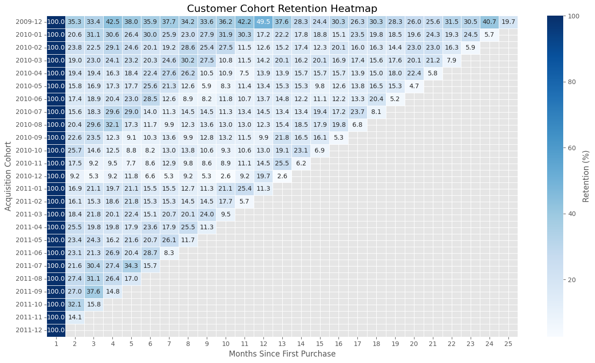
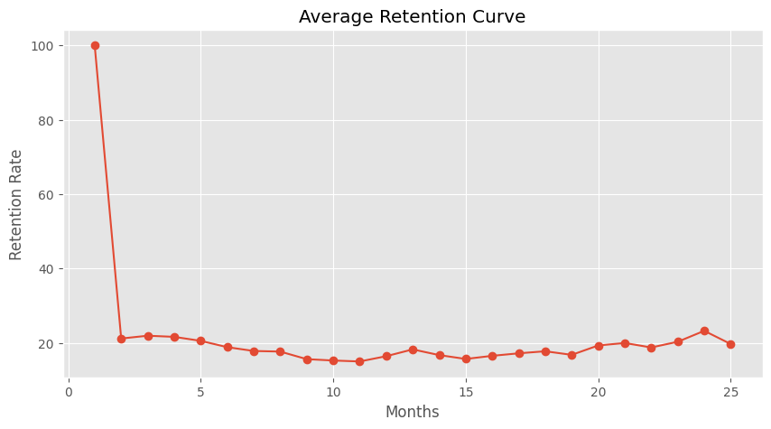

# 📊 SaaS/E-Commerce Cohort Retention & Customer Lifetime Value (CLTV) Analysis

## 🚀 Project Overview

Customer retention is one of the most important growth metrics for SaaS and e-commerce businesses. Acquiring new customers is significantly more expensive than retaining existing ones. This project applies **Cohort Analysis** to measure customer retention over time and **Customer Lifetime Value (CLTV)** analysis to estimate long-term customer profitability.

Using the **Online Retail II** dataset, this project identifies customer churn patterns, evaluates retention across acquisition cohorts, segments customers based on lifetime value, and provides actionable business insights to improve customer loyalty and maximize revenue.

---

# 🎯 Project Objectives

- Clean and preprocess transactional retail data
- Perform Exploratory Data Analysis (EDA)
- Build customer cohort retention matrix
- Measure monthly customer retention
- Calculate Customer Lifetime Value (CLTV)
- Segment customers based on CLTV
- Visualize customer retention and customer value
- Build an interactive Power BI dashboard
- Generate business recommendations

---

# 🛠️ Tech Stack

- Python
- Pandas
- NumPy
- Matplotlib
- Seaborn
- SQL
- Power BI
- Google Colab / Jupyter Notebook
- Git & GitHub

---

# 📂 Repository Structure

```text
saas-cohort-retention-cltv-analysis/
│
├── data/
│   ├── raw/
│   └── processed/
│
├── notebooks/
│   └── project_2_cohort_retention_cltv_analysis.ipynb
│
├── images/
│   ├── retention_heatmap.png
│   └── retention_curve.png
│
├── dashboard/
├── reports/
├── sql/
│
├── README.md
├── requirements.txt
└── .gitignore
```

---

# 📅 Project Progress

## ✅ Week 1 – Data Cleaning & Feature Engineering

### Completed Tasks

- Loaded and explored the Online Retail II dataset
- Removed missing Customer IDs
- Removed cancelled/refunded transactions
- Removed invalid quantities and prices
- Removed duplicate records
- Converted InvoiceDate to datetime format
- Created Revenue feature
- Generated Invoice Month
- Generated Cohort Month
- Calculated Cohort Index
- Prepared analysis-ready dataset

### Deliverable

- Cleaned and feature-engineered transactional dataset ready for customer analytics

---

## ✅ Week 2 – Cohort Retention Analysis

### Completed Tasks

- Built Customer Cohort Matrix
- Calculated Monthly Customer Retention
- Generated Retention Percentage Matrix
- Created Customer Retention Heatmap
- Created Average Retention Decay Curve
- Performed Customer Churn Analysis
- Documented Business Insights

### Key Insights

- Customer retention drops significantly after the first month.
- A small percentage of customers continue purchasing over many months.
- Early customer engagement plays a critical role in long-term retention.

---

## ✅ Week 3 – Customer Lifetime Value (CLTV) Analysis

### Completed Tasks

- Calculated Average Order Value (AOV)
- Calculated Purchase Frequency
- Estimated Customer Lifespan
- Calculated Historical Customer Lifetime Value (CLTV)
- Segmented customers into value-based categories
- Visualized CLTV distribution
- Identified top high-value customers
- Generated business insights and recommendations

### Key Insights

- Premium customers contribute a significant share of overall revenue.
- Customers with higher purchase frequency generate substantially greater lifetime value.
- Extending customer lifespan has a direct positive impact on CLTV.
- Customer segmentation enables targeted marketing and personalized retention strategies.

---

# 📈 Visualizations

### Customer Cohort Retention Heatmap



### Average Retention Curve



### Upcoming Visualizations

- Customer Lifetime Value Distribution
- Customer Segment Distribution
- Top Customers by CLTV
- Power BI Dashboard

---

# 📌 Dataset

**Dataset:** Online Retail II

The dataset contains transactional records of a UK-based online retailer between **December 2009 and December 2011**.

**Source**

https://www.kaggle.com/datasets/mashlyn/online-retail-ii-uci

> **Note:** The raw dataset is not included in this repository because of its size and Kaggle's distribution policy.

---

# 🚧 Remaining Work

## ✅ Week 4 – Business Intelligence & Reporting

- Interactive Power BI Dashboard
- KPI Cards
- Customer Retention Dashboard
- CLTV Dashboard
- Executive Summary
- Strategic Business Recommendations
- Final Project Documentation

---

# 📄 License

This project was developed as part of a **Data Analytics Internship** and is intended for educational and portfolio purposes.